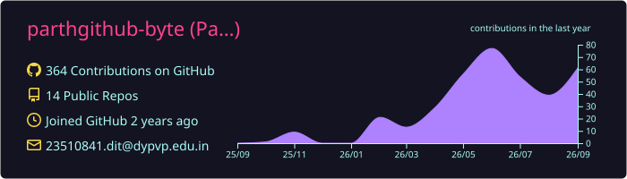
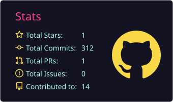
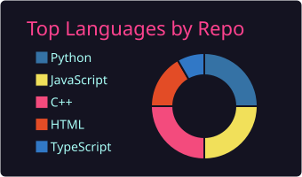
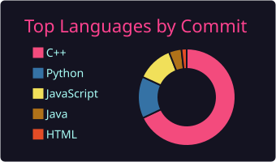
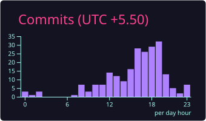
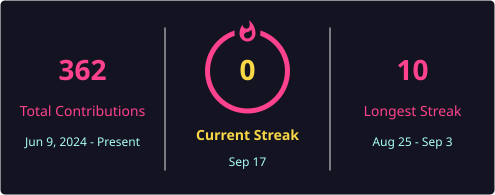

<h1 align="center">Hi, I'm Parth 👋</h1>

  

  
  
  
  
  

I'm a Computer Engineering student at **Dr. D. Y. Patil Institute of Technology, Pune**, interested in building robust applications and in the space where full-stack development meets AI. I'm actively looking for **software engineering internships and entry-level roles**.

---

## 🔭 What I'm Building

### 🔍 Digital Footprint Analyzer

An OSINT tool that maps how much of a person is publicly visible online.

It runs queries through a self-hosted **SearxNG** metasearch instance rather than a commercial search API, which keeps it unmetered and avoids leaking the subject's identifiers to a third party. Results feed a **NetworkX** graph linking usernames, emails and domains, so indirect exposure paths — the account that isn't obviously yours until it's connected through two hops — become visible. A **FastAPI** layer serves the analysis with per-artefact risk scoring.

`Python` · `FastAPI` · `SearxNG` · `NetworkX`

### 🚗 Safe Cruisers

An IoT vehicle safety system that intervenes rather than just warns.

Built on an **ESP32**, it combines eye-state monitoring for drowsiness with MQ-3 alcohol sensing on the driver side, and drives a **relay-based ignition interlock** when either crosses threshold. All detection logic runs on-device, so it stays functional with no network connection — a deliberate constraint, since a safety system that depends on connectivity isn't one.

`ESP32` · `C++` · `Sensor Interfacing` · `Relay Control`

### 💰 Finance Tracker

A full-stack personal finance app with category-wise expense breakdowns, monthly budget targets and spending visualisations, built on a **React** frontend over a **Flask** REST API and a normalised **MySQL** schema.

`React` · `Flask` · `Python` · `MySQL`

---

## 🧰 Toolkit

<table>
<tr>
  <td><b>Languages</b></td>
  <td></td>
</tr>
<tr>
  <td><b>Web</b></td>
  <td></td>
</tr>
<tr>
  <td><b>Data</b></td>
  <td></td>
</tr>
<tr>
  <td><b>Tooling</b></td>
  <td></td>
</tr>
<tr>
  <td><b>AI / LLM</b></td>
  <td>LangChain · LangGraph · RAG architectures</td>
</tr>
<tr>
  <td><b>Embedded</b></td>
  <td>ESP32 · Sensor interfacing · Relay modules</td>
</tr>
<tr>
  <td><b>Foundations</b></td>
  <td>DSA · OOP · DBMS · Operating Systems · Computer Networks</td>
</tr>
</table>

---

## 📚 Currently Learning

Agentic AI workflows with **LangChain** and **LangGraph**, retrieval-augmented generation, and system design for applications that need to scale past a single box.

---

## 🧮 Problem Solving

I keep a steady practice in data structures and algorithms, working primarily in **C++** with a focus on optimising for time and space rather than just passing tests.

<b>📊 Stats &amp; activity</b>

 

  
   
  
  
   
  
  

  

  

  

  

---

## 📬 Reach Me

**LinkedIn** [parth-p](https://www.linkedin.com/in/parth-p-987933289) &nbsp;·&nbsp; **Email** [23510841.dit@dypvp.edu.in](mailto:23510841.dit@dypvp.edu.in) &nbsp;·&nbsp; **LeetCode** [Thecodenthusiast](https://leetcode.com/u/Thecodenthusiast/) &nbsp;·&nbsp; **GeeksforGeeks** [parthpakharjng5](https://www.geeksforgeeks.org/user/parthpakharjng5/)

Open to collaborating on open-source, hackathons, and anything at the intersection of AI and systems.
